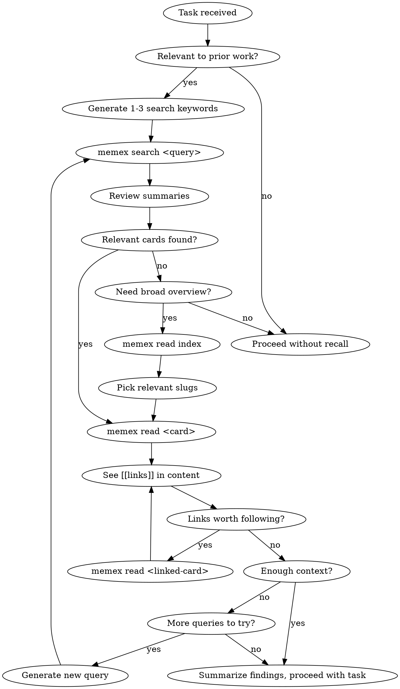

# Memory Recall

You have access to a Zettelkasten memory system via the `memex` CLI. Before starting this task, search your memory for relevant prior knowledge.

## Tools Available

Three equivalent interfaces — use whichever your environment supports:

| CLI (memex in PATH) | Plugin CLI fallback (Claude Code) | MCP tool (VSCode / Cursor) |
|----------------------|-----------------------------------|----------------------------|
| `memex read index`   | `node ~/.claude/plugins/cache/cc-plugins/memex/*/dist/cli.js read index` | `memex_read` with slug `index` |
| `memex search <q>`   | `node ~/.claude/plugins/cache/cc-plugins/memex/*/dist/cli.js search <q>` | `memex_search` with query arg |
| `memex read <slug>`  | `node ~/.claude/plugins/cache/cc-plugins/memex/*/dist/cli.js read <slug>` | `memex_read` with slug arg |
| `memex search` (no args) | `node ~/.claude/plugins/cache/cc-plugins/memex/*/dist/cli.js search` | `memex_search` with no args |

**Resolution order:** Try `memex` in PATH first. If not found, define a shell function and use it:

```bash
memex() { node $HOME/.claude/plugins/cache/cc-plugins/memex/*/dist/cli.js "$@"; }
```

If both CLI approaches fail, use MCP tools.

The rest of this skill uses `memex` CLI syntax for brevity.

## Process



### Step 1: Targeted keyword search (preferred)

Generate 1-3 search keywords from the current task and run `memex search <keyword>` for each. This is faster and more focused than reading the full index.

### Step 2: Read the keyword index (when needed)

If you need a broad overview of what's in memory (e.g. first time working in this area, or the task is vague), run `memex read index`. The index is a curated concept → card mapping. It's much smaller than all cards combined and gives you entry points.

### Step 3: Follow links

When you read a card and see `[[links]]` in the prose, decide if they're worth following. If yes, `memex read <linked-slug>`.

### Step 4: Summarize and proceed

When you have enough context, summarize your findings and proceed with the task.

## Guardrails

- **max_hops: 3** — Do not follow links more than 3 levels deep
- **max_cards_read: 20** — Do not read more than 20 cards in a single recall
- **no raw secrets** — Never include actual secrets, credentials, tokens, or exact secret file contents in search queries. Use abstract descriptions instead (e.g. `gitee pr auth workflow`, not a token value or credential file contents).
- If you hit either limit, stop and work with what you have

## Counting Rules

- Hop 0 = cards found directly via index or `memex search`. Following a `[[link]]` from there is hop 1, etc.
- Keep a running count of `memex read` calls. If you've read 20 cards, stop immediately.

## Important

- Prefer targeted `memex search <keyword>` over reading the full index — it's faster and more focused
- Only `memex read index` when you need a broad overview or search returns nothing useful
- Generate search queries in BOTH Chinese and English to maximize recall
- If search returns nothing useful, that's fine — proceed without memory context
- Summarize what you found before proceeding, so the findings are in your context
